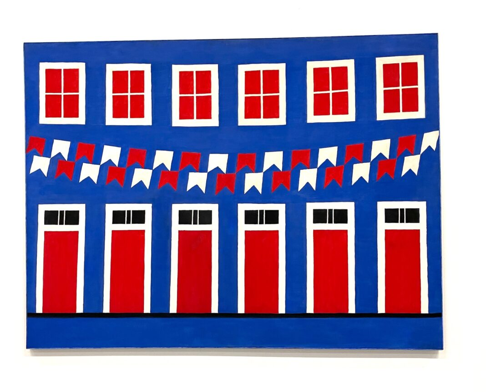

# Releitura Interativa de Alfredo Volpi

## Imagem de referência

Fonte: [BRASIL NA ITALIA - [Encerrada] Mostra do ítalo-brasileiro Alfredo Volpi no Pecci de Prato](https://www.brasilnaitalia.net/2024/05/alfredo-volpi-no-pecci.html)

## Referência da pintura

> Grande Fachada Festiva. Alfredo Volpi, 1959.

## Arquivos do projeto

| Arquivo | Descrição |
|---|---|
| `index.html` | Página principal que carrega a biblioteca p5.js e os scripts |
| `carolinePaz.js` | Desenho estático da fachada: janelas, portas e fechaduras; Desenho e animação das fileiras de bandeirinhas; Setup do canvas e loop de animação principal |

## Descrição da animação

A releitura recria digitalmente a fachada festiva de Volpi com duas camadas de animação inspiradas no movimento real das bandeirinhas ao vento.

**Bandeirinhas (automática):** As duas fileiras de bandeirinhas oscilam continuamente de forma senoidal. A fileira superior e a inferior se movem em fases opostas, quando uma vai para a direita, a outra vai para a esquerda, criando um balanço ritmado que remete ao vento nas festas juninas. O deslocamento de cada bandeirinha é proporcional à sua distância do centro do canvas, preservando a curvatura natural do varal: as pontas balançam mais e o centro quase não se move.